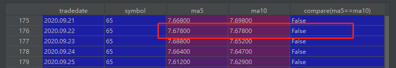
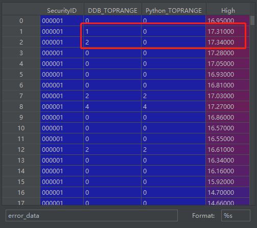

# mytt (My麦语言 T通达信 T同花顺)指标库

MyTT是一个简单易用的Python库，它将通达信、同花顺、文华麦语言等指标公式最简化移植到了Python中，实现的常见指标包括MACD、RSI、BOLL、ATR、KDJ、CCI、PSY等。MyTT全部基于numpy和pandas的函数进行封装。

为了方便用户在DolphinDB中计算这些技术指标，我们使用DolphinDB脚本实现了MyTT中包含的指标函数，并封装在DolphinDB mytt module中。 相比于Python中的MyTT库，DolphinDB mytt module中的计算函数不仅在批处理中性能有大幅提升，而且支持DolphinDB的流式增量计算引擎，可以直接用于实时流计算场景。

因为DolphinDB mytt module是基于DolphinDB V1.30.18和DolphinDB V2.00.6开发的，所以建议用户使用DolphinDB V1.30.18和DolphinDB V2.00.6及以上版本运行mytt指标库中的函数。在DolphinDB V1.30.19和DolphinDB V2.00.7支持了`BARSLAST`, `BARSLASTCOUNT`, `TOPRANGE`, `LOWRANGE`函数在流式增量计算引擎中的使用。在DolphinDB V1.30.21和DolphinDB V2.00.9中`CROSS`函数与DolphinDB内置变量名冲突，函数名修改为`CROSS_`。

匹配不同DolphinDB版本的mytt module：

* V1.30.18, V2.00.6: [mytt.dos](./src/1.30.18or2.00.6/mytt.dos)
* V1.30.19, V2.00.7: [mytt.dos](./src/1.30.19or2.00.7/mytt.dos)
* V1.30.21, V2.00.9: [mytt.dos](./src/1.30.21or2.00.9/mytt.dos)

本教程包含内容：

- [mytt (My麦语言 T通达信 T同花顺)指标库](#mytt-my麦语言-t通达信-t同花顺指标库)
  - [1. 函数及参数的命名与用法规范](#1-函数及参数的命名与用法规范)
  - [2. 环境配置](#2-环境配置)
  - [3. 使用范例](#3-使用范例)
  - [4. 函数计算性能](#4-函数计算性能)
  - [5. 正确性验证](#5-正确性验证)
  - [6. 实时流计算案例](#6-实时流计算案例)
  - [7. DolphinDB mytt指标列表](#7-dolphindb-mytt指标列表)
  - [8. 路线图（Road Map）](#8-路线图road-map)

## 1. 函数及参数的命名与用法规范

- Python MyTT库中所有函数名大写，所有参数名大写，为适应使用者的使用习惯，DolphinDB mytt module中的函数名、参数、参数默认值均与MyTT保持一致。
- 为得到有意义的计算结果，mytt中函数的参数表示时间跨度的参数均要求至少是2。
- 由于LAST函数与DolphinDB中内置关键字冲突，mytt中将此函数命名为LAST_。

## 2. 环境配置

把附件的mytt.dos放在节点的[home]/modules目录下，[home]目录由系统配置参数home决定，可以通过`getHomeDir()`函数查看。初次使用模块文件时，[home]目录没有modules目录，手动创建modules目录，然后把mytt.dos模块文件放入该目录即可。

DolphinDB模块使用的教程文档：[ DolphinDB教程：模块](https://gitee.com/dolphindb/Tutorials_CN/blob/master/module_tutorial.md)

## 3. 使用范例

### 3.1 脚本中直接使用指标函数

对一个向量直接使用mytt模块中的`EMA`函数（指数平滑法）进行计算：

```
//如果未设置自动加载mytt module，新会话需要手动加载一次mytt module
use mytt

close = 7.2 6.97 7.08 6.74 6.49 5.9 6.26 5.9 5.35 5.63
x = EMA(close, 5)
```

### 3.2 在SQL语句中分组使用

用户经常需要在数据表中对多组数据在每组内进行计算。在以下例子中，先构造了一个包含2个股票的数据表：

```
use mytt

close = 7.2 6.97 7.08 6.74 6.49 5.9 6.26 5.9 5.35 5.63 3.81 3.935 4.04 3.74 3.7 3.33 3.64 3.31 2.69 2.72
date = (2020.03.02 + 0..4 join 7..11).take(20)
symbol = take(`F,10) join take(`GPRO,10)
t = table(symbol, date, close)
```

对其中每只股票使用mytt模块中的`EMA`函数进行计算：

```sql
update t set EMA = EMA(close, 5) context by symbol
```

### 3.3 返回多个列的结果

某些函数会返回多个列的结果，例如函数`BIAS`(乘离率指标)。

直接使用的例子：

```
use mytt

close = 7.2 6.97 7.08 6.74 6.49 5.9 6.26 5.9 5.35 5.63
bias1, bias2, bias3 = BIAS(close, L1 = 2, L2 = 4, L3 = 6)
```

在SQL语句中使用的例子：

```
use mytt

close = 7.2 6.97 7.08 6.74 6.49 5.9 6.26 5.9 5.35 5.63 3.81 3.935 4.04 3.74 3.7 3.33 3.64 3.31 2.69 2.72
date = (2020.03.02 + 0..4 join 7..11).take(20)
symbol = take(`F,10) join take(`GPRO,10)
t = table(symbol, date, close) 
select *, BIAS(close, L1 = 2, L2 = 4, L3 = 6) as `bias1`bias2`bias3 from t context by symbol

symbol date       close  bias1    bias2    bias3
------ ---------- ----- -------- -------- --------
F      2020.03.02 7.2
F      2020.03.03 6.97 -1.623
F      2020.03.04 7.08  0.783  
F      2020.03.05 6.74 -2.46     -3.68
F      2020.03.06 6.49 -1.89     -4.839    
F      2020.03.09 5.9  -4.762    -9.958   -12.333
F      2020.03.10 6.26  2.961    -1.378   -4.767
F      2020.03.11 5.9  -2.961    -3.87    -7.74
F      2020.03.12 5.35 -4.889    -8.586   -12.391
F      2020.03.13 5.63  2.55     -2.679   -4.925
GPRO   2020.03.02 3.81
GPRO   2020.03.03 3.935 1.614
GPRO   2020.03.04 4.04  1.317   
GPRO   2020.03.05 3.74 -3.856    -3.639
GPRO   2020.03.06 3.7  -0.538    -3.99 
GPRO   2020.03.09 3.33 -5.263    -10.061 -11.417
GPRO   2020.03.10 3.64  4.448     1.041  -2.435
GPRO   2020.03.11 3.31 -4.748    -5.293  -8.732
GPRO   2020.03.12 2.69 -10.333   -17.039 -20.921
GPRO   2020.03.13 2.72  0.555    -11.974 -15.833
```

## 4. 函数计算性能

本节将以`AVEDEV`函数为例做直接使用的性能对比，同时使用真实股票日频数据对所有函数进行分组使用性能对比。

### 4.1 直接使用性能对比

在DolphinDB中：

```
use mytt

close = 7.2 6.97 7.08 6.74 6.49 5.9 6.26 5.9 5.35 5.63
close = take(close, 100000)
timer x = mytt::AVEDEV(close, 100)
```

对一个长度为100000的向量直接使用mytt模块中的`AVEDEV`函数，耗时为25ms。

与之对应的Python代码如下：

```python
import numpy as np
from MyTT import *
import time

close = np.array([7.2,6.97,7.08,6.74,6.49,5.9,6.26,5.9,5.35,5.63])
close = np.tile(close,10000)
start_time = time.time()
x = AVEDEV(close, 100)
print("--- %s seconds ---" % (time.time() - start_time))
```

Python MyTT库中的`AVEDEV`函数耗时为25000ms，是DolphinDB mytt module中的`AVEDEV`函数的1000倍。测试数据量越大，性能差异越显著。

### 4.2 分组使用性能对比

* 测试数据为上海证券交易所2020年，全年2919个证券（筛选交易日大于120）日频交易数据，总记录数为686,104条。
* 计算逻辑为按照股票代码进行分组计算各指标。
* 为了测试函数计算性能，DolphinDB和Python测试代码都是单线程运行。
* [DolphinDB测试代码](./test/DolphinDBRunTime.txt)
* [Python测试代码](./test/PythonRunTime.py)
* [测试数据](./test/testData.csv)
* [Python MyTT库](./test/MyTT.py)

测试结果如下表所示：

| 序号 | 函数          | Python（ms） | DolphinDB（ms） | 运行时间比 |
| ---- | ------------- | ------------ | --------------- | ---------- |
| 1    | RD            | 296          | 16              | 18         |
| 2    | RET           | 243          | 13              | 18         |
| 3    | ABS           | 229          | 15              | 15         |
| 4    | LN            | 253          | 25              | 10         |
| 5    | POW           | 311          | 30              | 10         |
| 6    | SQRT          | 248          | 19              | 13         |
| 7    | MAX           | 390          | 34              | 11         |
| 8    | MIN           | 373          | 29              | 12         |
| 9    | IF            | 282          | 21              | 13         |
| 10   | REF           | 740          | 17              | 43         |
| 11   | DIFF          | 662          | 22              | 30         |
| 12   | STD           | 1,263        | 24              | 98         |
| 13   | SUM           | 1,297        | 22              | 58         |
| 14   | CONST         | 258          | 22              | 11         |
| 15   | HHV           | 1,207        | 30              | 40         |
| 16   | LLV           | 1,218        | 31              | 39         |
| 17   | HHVBARS       | 2,952        | 41              | 72         |
| 18   | LLVBARS       | 2,878        | 38              | 75         |
| 19   | MA            | 1,220        | 24              | 50         |
| 20   | EMA           | 1,171        | 26              | 45         |
| 21   | SMA           | 1,199        | 28              | 42         |
| 22   | WMA           | 4,322        | 20              | 216        |
| 23   | DMA           | 1,123        | 27              | 41         |
| 24   | AVEDEV        | 176,652      | 32              | 5,520      |
| 25   | SLOPE         | 53,703       | 29              | 1,851      |
| 26   | FORCAST       | 60,321       | 38              | 1,587      |
| 27   | LAST          | 4,132        | 38              | 108        |
| 28   | COUNT         | 1,249        | 20              | 62         |
| 29   | EVERY         | 1,267        | 28              | 45         |
| 30   | EXIST         | 1,490        | 22              | 67         |
| 31   | BARSLAST      | 559          | 18              | 31         |
| 32   | BARSLASTCOUNT | 607          | 17              | 35         |
| 33   | CROSS_        | 2,088        | 80              | 26         |
| 34   | LONGCROSS     | 6,019        | 94              | 64         |
| 35   | VALUEWHEN     | 968          | 27              | 35         |
| 36   | BETWEEN       | 489          | 42              | 11         |
| 37   | TOPRANGE      | 3,647        | 37              | 99         |
| 38   | LOWRANGE      | 3,703        | 36              | 103        |
| 39   | MACD          | 3,060        | 86              | 35         |
| 40   | KDJ           | 4,705        | 144             | 32         |
| 41   | RSI           | 2,539        | 103             | 24         |
| 42   | WR            | 5,632        | 166             | 33         |
| 43   | BIAS          | 5,318        | 135             | 39         |
| 44   | BOLL          | 3,067        | 90              | 34         |
| 45   | PSY           | 2,596        | 82              | 31         |
| 46   | CCI           | 163,681      | 76              | 2,153      |
| 47   | ATR           | 2,281        | 101             | 22         |
| 48   | BBI           | 3,667        | 66              | 55         |
| 49   | DMI           | 6,181        | 250             | 24         |
| 50   | TAQ           | 2,292        | 64              | 35         |
| 51   | KTN           | 3,170        | 164             | 19         |
| 52   | TRIX          | 4,329        | 97              | 44         |
| 53   | VR            | 2,732        | 117             | 23         |
| 54   | EMV           | 4,437        | 132             | 33         |
| 55   | DPO           | 2,455        | 59              | 41         |
| 56   | BRAR          | 4,909        | 156             | 31         |
| 57   | DFMA          | 2,890        | 52              | 55         |
| 58   | MTM           | 1,659        | 43              | 38         |
| 59   | MASS          | 4,602        | 99              | 46         |
| 60   | ROC           | 2,000        | 63              | 31         |
| 61   | EXPMA         | 1,900        | 49              | 38         |
| 62   | OBV           | 1,790        | 94              | 19         |
| 63   | MFI           | 3,488        | 158             | 22         |
| 64   | ASI           | 4,173        | 316             | 13         |

从测试结果分析可知：

* DolphinDB mytt module中的函数计算性能远远超过Python MyTT库，最大的性能差距达到5520倍，普遍性能差距在30倍左右。

**Python pandas测试核心代码**

```python
data.groupby("symbol").apply(lambda x: RSI(np.array(x.close), N = 24))
```

**DolphinDB测试核心代码**

```sql
RSI = select symbol, tradedate, mytt::RSI(close, N=24) as `RSI from data context by symbol
```

## 5. 正确性验证

基于4.2分组使用性能对比中的测试数据和代码，验证DolphinDB mytt module中函数的计算结果是否和Python MyTT库一致。

### 5.1 浮点数精度问题

**结果有差异的函数**

* ```CROSS_, LONGCROSS```

**原因**

* 浮点数精度问题
* 对于CROSS_和LONGCROSS函数，在浮点数比较上，DolphinDB mytt module中的处理比Python MyTT库更加严谨。DolphinDB mytt module中首先会对浮点数round保留小数点后6位，然后再进行大小判断，而MyTT中并没有类似处理，因此对于相同大小的浮点数，Python的判别可能会出错，如下图所示：



### 5.2 NULL值的处理

**结果有差异的函数**

* ```SUM, DMI, EMV, MASS, MFI, ASI```

**原因**

* 若输入向量开始包含空值，则从第一个非空位置开始计算。DolphinDB mytt module与Python MyTT库的计算规则一致。

* 对一个滚动/累积窗口长度为k的函数，每组最初的(k-1)个位置的结果均为空。DolphinDB mytt module与Python MyTT库的计算规则一致。

* 对一个滚动/累积窗口长度为k的函数，若一组中第一个非空值之后再有空值，Python MyTT库会对包含nan的窗口计算结果都处理为nan。DolphinDB mytt module会对窗口内非NULL的元素按计算规则计算，得到一个非NULL的计算结果。

DolphinDB代码与结果：

```
close = [99.9, NULL, 84.69, 31.38, 60.9, 83.3, 97.26, 98.67]
mytt::SUM(close, 5);

[,,,,276.87, 260.27, 357.53, 371.51]
```
Python代码与结果：
```
close = np.array([99.9, np.nan, 84.69, 31.38, 60.9, 83.3, 97.26, 98.67])
MyTT.SUM(close,5)

array([nan, nan, nan, nan, nan,  nan, 357.53, 371.51])
```

以滑动窗口求和为例，close向量的第2个元素为空值，DolphinDB mytt module在计算第5个元素（60.9）时，回看过去5个窗口内的数据`[99.9, NULL, 84.69, 31.38, 60.9]`，对非NULL的元素求和，所以结果向量的第5个元素为276.87。

Python MyTT库会对包含nan的窗口计算结果都处理为nan，所以结果向量的前6个元素都为nan。

除上述因为浮点数精度问题和NULL值的处理问题导致计算结果存在差异外，其余函数计算结果的百分比误差均小于1e-10。

### 5.3 TOPRANGE、LOWRANGE计算结果差异问题

TOPRANGE函数是统计S序列的某个元素是近多少周期内的最大值，`TOPRANGE(High)`表示创多少日新高。

mytt模块中的TOPRANGE函数与MyTT中的TOPRANGE函数在头部数据的计算中有差异，如下图所示，High序列`16.95, 17.31, 17.34`其TOPRANGE分别为创`0日新高，1日新高，2日新高`。MyTT在数据先下降再上升之后才开始统计创多少日新高，而mytt模块则从数据头部就开始统计创多少日新高。从而造成数据头部的计算结果会有差异。



LOWRANGE函数与上述情况相同。

## 6. 实时流计算案例

在DolphinDB V1.30.3中发布的响应式状态引擎（[Reactive State Engine](https://www.dolphindb.cn/cn/help/200/FunctionsandCommands/FunctionReferences/c/createReactiveStateEngine.html)）是许多金融场景流批统一计算中的重要构件，DolphinDB mytt module在开发时就对其做了适配，使得mytt模块中的大部分函数可以在响应式状态引擎中实现增量计算。

- 无需支持在响应式状态引擎的中使用的函数：```RET, CONST```。

- 所有mytt中的**技术指标函数**均支持增量计算。

示例代码如下：

```sql
def cleanEnvironment(){
	try{ unsubscribeTable(tableName="snapshotStream",actionName="aggr1min") } catch(ex){ print(ex) }
	try{ dropStreamEngine("myttReactiveStateEngine") } catch(ex){ print(ex) }
	try{ dropStreamEngine("aggr1min") } catch(ex){ print(ex) }
	try{ dropStreamTable(`snapshotStream) } catch(ex){ print(ex) }
	try{ dropStreamTable(`outputTable) } catch(ex){ print(ex) }
	undef all
}
cleanEnvironment()
go

//load modules
use mytt

//define stream table
name = `tradetime`SecurityID`high`low`open`close`vol
type = `TIMESTAMP`SYMBOL`DOUBLE`DOUBLE`DOUBLE`DOUBLE`INT
share streamTable(100:0, name, type) as snapshotStream
name = `SecurityID`tradetime`K`D`J`DIF`DEA`MACD`UPPER`MID`LOWER`ROC`MAROC
type = `SYMBOL`TIMESTAMP`DOUBLE`DOUBLE`DOUBLE`DOUBLE`DOUBLE`DOUBLE`DOUBLE`DOUBLE`DOUBLE`DOUBLE`DOUBLE
share streamTable(1000000:0, name, type) as outputTable

//register stream computing engine
reactiveStateMetrics=<[
    tradetime,
    mytt::KDJ(close, high, low, N=9, M1=3, M2=3) as `K`D`J,
    mytt::MACD(close, SHORT_=12, LONG_=26, M=9) as `DIF`DEA`MACD,
    mytt::KTN(close, high, low, N=20, M=10) as `UPPER`MID`LOWER,
    mytt::ROC(close, N=12, M=6) as `ROC`MAROC
]>

createReactiveStateEngine("myttReactiveStateEngine", metrics=reactiveStateMetrics, dummyTable=snapshotStream, outputTable=outputTable, keyColumn=`SecurityID, keepOrder=true)

createTimeSeriesEngine(name="aggr1min", windowSize=60000, step=60000, metrics=<[first(open),max(high),min(low),last(close),sum(vol)]>, dummyTable=snapshotStream, outputTable=getStreamEngine("myttReactiveStateEngine"), timeColumn=`tradetime, useWindowStartTime=true, keyColumn=`SecurityID)

subscribeTable(tableName="snapshotStream", actionName="aggr1min", offset=-1, handler=getStreamEngine("aggr1min"), msgAsTable=true, batchSize=2000, throttle=1, hash=0, reconnect=true)
```

## 7. DolphinDB mytt指标列表

### 7.1 核心工具函数

| **函数** | **语法**         | **解释**                                                     |
| -------- | ---------------- | ------------------------------------------------------------ |
| RD       | RN(N, D = 3)     | 四舍五入取3位小数                                            |
| RET      | RET(S, N = 1)    | 返回序列`倒数第N个值`，默认返回最后一个                      |
| ABS      | ABS(S)           | 返回序列或数值S的绝对值                                      |
| LN       | LN(S)            | 求序列S底是e的自然对数                                       |
| POW      | POW(S, N)        | 求序列S的N次方                                               |
| SQRT     | SQRT(S)          | 求序列S的平方根                                              |
| MAX      | MAX(S1, S2)      | 配对比较两个序列，给出比较以后大的序列                       |
| MIN      | MIN(S1, S2)      | 配对比较两个序列，给出比较以后小的序列                       |
| IF       | IF(S, A, B)      | 序列布尔判断，if S == True return A else B                   |
| REF      | REF(S, N = 1)    | 对序列整体下移动N个单位，返回平移后的序列，会产生NAN         |
| DIFF     | DIFF(S, N = 1)   | 序列S的前一个值减后一个值，序列头部会产生NAN                 |
| STD      | STD(S, N)        | 求序列S的滚动N日标准差，返回滚动标准差序列                   |
| SUM      | SUM(S, N)        | 对序列S求滚动N日总和                                         |
| CONST    | COUNT(S)         | 返回序列S最后一个值组成常量序列                              |
| HHV      | HHV(S, N)        | 求序列S的滚动N日最大值，返回滚动最大值序列                   |
| LLV      | LLV(S, N)        | 求序列S的滚动N日最小值，返回滚动最小值序列                   |
| HHVBARS  | HHVBARS(S, N)    | 求序列S的滚动N期内最高值到当前的天数, 返回距离天数序列       |
| LLVBARS  | LLVBARS(S, N)    | 求序列S的滚动N期内最低值到当前的天数, 返回距离天数序列       |
| MA       | MA(S, N)         | 求序列S的N日简单移动平均值，返回移动平均序列                 |
| EMA      | EMA(S, N)        | 求序列S的指数移动平均，为了精度，S>4*N，EMA至少需要120周期alpha = 2/(span+1) |
| SMA      | SMA(S, N, M = 1) | 中国式的SMA，至少需要120周期才精确 (雪球180周期)，alpha = 1/(1+N) |
| WMA      | WMA(S, N)        | 求S序列S的N日加权移动平均，`Yn = (1*X1+2*X2+3*X3+...+n*Xn)/(1+2+3+...+n)` |
| DMA      | DMA(S, A)        | 求S的动态移动平均，A作平滑因子，必须 0 < A < 1               |
| AVEDEV   | AVEDEV(S, N)     | 求序列S的滚动平均绝对偏差                                    |
| SLOPE    | SLOPE(S, N)      | 求序列S的滚动N周期内的线性回归模型的斜率                     |
| FORCAST  | FORCAST(S, N)    | 求序列S的滚动N周期内的线性回归模型的预测值                   |
| LAST_    | LAST_(S, A, B)   | BOOL型判断，从前A日到前B日一直满足BOOL条件，要求A > B & A > 0 & B >= 0 |

### 7.2 应用层函数(通过核心工具函数实现）

| **函数**        | **语法**               | **解释**                                                                           |
|---------------|----------------------|----------------------------------------------------------------------------------|
| COUNT         | COUNT(S, N)          | 序列S是BOOL型，求最滚动N天内满足BOOL为True的天数                                                  |
| EVERY         | EVERY(S, N)          | 序列S是BOOL型，求最滚动N天内`全部`满足BOOL为True的天数                                              |
| EXIST         | EXIST(S, N)          | 序列S是BOOL型，判断最滚动N天内`是否存在`满足BOOL为True                                              |
| BARSLAST      | BARSLAST(S)          | 序列S是BOOL型，统计上一次条件成立到当前的周期                                                        |
| BARSLASTCOUNT | BARSLASTCOUNT(S)     | 序列S是BOOL型，统计连续满足条件的周期数                                                           |
| BARSSINCEN    | BARSSINCEN(S, N)     | 序列S是BOOL型，统计滚动周期N内第一次满足条件到当前的周期数                                                 |
| CROSS_        | CROSS_(S1, S2)       | 判断两个序列是否交叉的函数，判断向上金叉穿越 CROSS\_(MA(C,5),MA(C,10)) ，判断向下死叉穿越 CROSS\_(MA(C,10),MA(C,5)) |
| LONGCROSS     | LONGCROSS(S1, S2, N) | 判断两个序列是否在个持一定周期后再交叉的函数，判断两个序列是否再个持N周期后再交叉，N = 1时等同于CROSS_(S1, S2)                |
| VALUEWHEN     | VALUEWHEN(S, X)      | 解决当S条件成立时,取X的当前值,否则取S的上个成立时对应的X值                                                 |
| BETWEEN       | BETWEEN(S, A, B)     | 判断S序列是否介于A和B之间的函数，当S处于A和B之间时为真，包括 A<S<B 或 A>S>B                                  |
| TOPRANGE      | TOPRANGE(S)    | 统计S序列的某个元素是近多少周期内的最大值                                                            |
| LOWRANGE      | LOWRANGE(S)    | 统计S序列的某个元素是近多少周期内的最小值                                                            |

### 7.3 技术指标函数(全部通过核心工具和应用函数实现）

| **函数** | **语法**                                      | **解释**                      |
| -------- | --------------------------------------------- | ----------------------------- |
| MACD     | MACD(CLOSE, SHORT = 12, LONG = 26, M = 9)     | 平滑异同平均线                |
| KDJ      | KDJ(CLOSE, HIGH, LOW, N = 9, M1 = 3, M2 = 3)  | KDJ指标                       |
| RSI      | RSI(CLOSE, N = 24)                            | RSI指标,和通达信小数点2位相同 |
| WR       | WR(CLOSE, HIGH, LOW, N = 10, N1 = 6)          | W&R 威廉指标                  |
| BIAS     | BIAS(CLOSE, L1 = 6, L2 = 12, L3 = 24)         | BIAS乖离率                    |
| BOLL     | BOLL(CLOSE, N = 20, P = 2)                    | BOLL指标，布林带              |
| PSY      | PSY(CLOSE, N = 12, M = 6)                     | PSY指标，心理线               |
| CCI      | CCI(CLOSE, HIGH, LOW, N = 14)                 | CCI指标，顺势线               |
| ATR      | ATR(CLOSE, HIGH, LOW, N = 20)                 | 真实波动N日平均值             |
| BBI      | BBI(CLOSE, M1 = 3, M2 = 6, M3 = 12, M4 = 20)  | BBI多空指标                   |
| DMI      | DMI(CLOSE, HIGH, LOW, M1 = 14, M2 = 6)        | DMI动向指标                   |
| TAQ      | TAQ(HIGH, LOW, N)                             | 唐安奇通道(海龟)交易指标      |
| KTN      | KTN(CLOSE, HIGH, LOW, N = 20, M = 10)         | 肯特纳交易通道                |
| TRIX     | TRIX(CLOSE, M1 = 12, M2 = 20)                 | 三重指数平滑平均线            |
| VR       | VR(CLOSE, VOL, M1 = 26)                       | VR容量比率                    |
| EMV      | EMV(HIGH, LOW, VOL, N = 14, M = 9)            | EMV简易波动指标               |
| DPO      | DPO(CLOSE, M1 = 20, M2 = 10, M3 = 6)          | 区间震荡线                    |
| BRAR     | BRAR(OPEN, CLOSE, HIGH, LOW, M1 = 26)         | BRAR-ARBR 情绪指标            |
| DFMA     | DFMA(CLOSE, N1 = 10, N2 = 50, M = 10)         | DFMA平行线差指标              |
| MTM      | MTM(CLOSE, N = 12, M = 6)                     | MTM动量指标                   |
| MASS     | MASS(HIGH, LOW, N1 = 9, N2 = 25, M = 6)       | 梅斯线                        |
| ROC      | ROC(CLOSE, N = 12, M = 6)                     | 变动率指标                    |
| EXPMA    | EXPMA(CLOSE, N1 = 12, N2 = 50)                | 指数平均数指标                |
| OBV      | OBV(CLOSE, VOL)                               | 能量潮指标                    |
| MFI      | MFI(CLOSE, HIGH, LOW, VOL, N = 14)            | MFI资金流量                   |
| ASI      | ASI(OPEN, CLOSE, HIGH, LOW, M1 = 26, M2 = 10) | 振动升降指标                  |

##  8. 路线图（Road Map）

* 长期保持对Python MyTT包的同步更新。

## 附件

* V1.30.18, V2.00.6: [mytt.dos](./src/1.30.18or2.00.6/mytt.dos)
* V1.30.19, V2.00.7: [mytt.dos](./src/1.30.19or2.00.7/mytt.dos)
* [DolphinDB测试代码](./test/DolphinDBRunTime.txt)
* [Python测试代码](./test/PythonRunTime.py)
* [测试数据](./test/testData.csv)
* [Python MyTT库](./test/MyTT.py)

**计算性能测试环境**

* CPU类型：Intel(R) Core(TM) i7-7700 CPU @ 3.60GHz   3.60 GHz
* 逻辑CPU总数：8
* 内存：32GB
* OS：Windows 10
