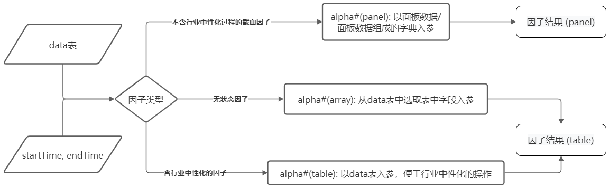

# WorldQuant 101 Alpha 因子指标库 <!-- omit in toc -->

挖掘和计算 alpha 因子在量化金融领域有着重要的意义。在WorldQuant 发表的论文 [101 Formulaic Alphas](https://arxiv.org/pdf/1601.00991.pdf) 中，Kakushadze 列出了101个 alpha 因子的公式。为方便用户在 DolphinDB 中计算因子，本文使用 DolphinDB 脚本实现了所有101个因子的函数，并封装在 DolphinDB 模块wq101alpha ([wq101alpha.dos](src/wq101alpha.dos)) 中。  

该模块的实现具有三大优势：
* 实现简单：在 DolphinDB 中基本可以实现原公式的一对一直接翻译。
* 性能优越：性能远优于传统的 Python pandas 实现方式，平均性能是 Python pandas 的250倍，中位数是15.5倍。
* 批流一体：模块中定义的因子函数，既可以用于历史计算，又可以用于流式增量计算。

> 本教程包含的所有代码兼容 DolphinDB 2.00.8，1.30.20 及以上版本。

本教程包含内容：

- [1. 函数及参数的命名与用法规范](#1-函数及参数的命名与用法规范)
  - [1.1 函数介绍](#11-函数介绍)
  - [1.2 输入字段介绍](#12-输入字段介绍)
  - [1.3 因子类型介绍](#13-因子类型介绍)
  - [1.4 流程图示](#14-流程图示)
  - [1.5 返回数据格式总结](#15-返回数据格式总结)
  - [1.6 环境配置](#16-环境配置)
- [2. 使用范例](#2-使用范例)
  - [2.1 计算前准备](#21-计算前准备)
  - [2.2 面板数据入参计算的截面因子](#22-面板数据入参计算的截面因子)
  - [2.3 表入参计算行业信息因子](#23-表入参计算行业信息因子)
  - [2.4 向量入参计算无状态因子](#24-向量入参计算无状态因子)
- [3. 因子的存储](#3-因子的存储)
  - [3.1 面板数据格式的因子存储](#31-面板数据格式的因子存储)
  - [3.2 表形式的因子存储](#32-表形式的因子存储)
- [4. 性能对比](#4-性能对比)
  - [4.1 DolphinDB 与 Python Pandas 性能对比](#41-dolphindb-与-python-pandas-性能对比)
  - [4.2 DolphinDB 与 Python numpy 的性能对比](#42-dolphindb-与-python-numpy-的性能对比)
- [5. 正确性验证](#5-正确性验证)
  - [5.1 包含截面计算的因子验证](#51-包含截面计算的因子验证)
  - [5.2 无状态因子验证](#52-无状态因子验证)
  - [5.3 含行业中性化因子验证](#53-含行业中性化因子验证)
  - [5.4 小结](#54-小结)
- [6. 实时流计算实现](#6-实时流计算实现)
- [7. 小结](#7-小结)
- [8. 附件汇总](#8-附件汇总)

## 1. 函数及参数的命名与用法规范

### 1.1 函数介绍

`wq101alpha` 模块中供用户直接调用的函数为`WQAlpha#`， 如`WQAlpha1`，`WQAlpha2`。每个因子的计算方式和输入参数都不同，相关说明请参考 [返回数据格式总结](#15-返回数据格式总结) 和 [输入字段介绍](#12-输入字段介绍)。用户也可以根据自己需求在模块中做修改。
  
`WQAlpha#`函数的输入与输出根据因子特点可分为三类：
  - 不含行业信息的截面因子：
	- 输入：面板数据
	- 输出：面板数据
	
  - 无状态因子：
	- 输入：向量
	- 输出：向量
	
  - 行业信息因子：
	- 输入：数据表
	- 输出：数据表


### 1.2 输入字段介绍

表格中的参数名称即为模块中的标准字段名称。

| **参数名称 / 标准字段名称** | **参数含义** |
| :------: | :-----: |
| tradetime | 交易时间 |
| securityid | 股票代码 |
| open | 开盘价 |
| close | 收盘价 |
| high | 最高价 |
| low | 最低价 |
| vol | 交易量 |
| vwap | 成交量加权平均价格 |
| cap | 市值 |
| indclass | 行业类型 |

数据表中若缺失特定的数据列（如缺失 `vwap` 数据），将会导致部分因子无法计算。因此计算某个因子前，应保证相应字段的数据存在。以下为三大类因子中各个因子所需的参数。

- 不含行业信息的截面因子

| 因子序号                              | 所需参数                | 因子序号2              | 所需参数3                   | 因子序号4  | 所需参数5                    |
| ------------------------------------- | ----------------------- | ---------------------- | --------------------------- | ---------- | ---------------------------- |
| 1, 9, 10, 19, 24, 29, 34, 46,  49, 51 | close                   | 22.                    | vol, high, close            | 66.        | vwap, open, high, low        |
| 2, 14                                 | vol,  open, close       | 23.                    | high                        | 71.        | vwap,  vol, open, close, low |
| 3, 6                                  | vol, open               | 25, 47, 74             | vwap, vol, close, high      | 72, 77     | vwap, vol, high, low         |
| 4.                                    | low                     | 27,  50, 61, 81        | vwap,  vol                  | 73.        | vwap,  open, low             |
| 5.                                    | vwap, open, close       | 28, 35, 55, 60, 68, 85 | vol, high, low, close       | 75, 78     | vwap, vol, low               |
| 7, 12, 13, 17, 21, 30, 39, 43, 45     | vol,  close             | 31,  52                | vol,  close, low            | 83.        | vwap,  vol, close, high, low |
| 8, 18, 33, 37, 38                     | open, close             | 32, 42, 57, 84         | vwap, close                 | 88, 92, 94 | vol, open, close, high, low  |
| 11, 96                                | vwap,  vol, close       | 36,  86                | vwap,  vol, open, close     | 95.        | vol,  open, high, low        |
| 15, 16, 26, 40, 44                    | vol, high               | 53.                    | close, high, low            | 65, 98     | vwap, vol, open              |
| 20.                                   | open,  close, high, low | 62,  64                | vwap,  vol, open, high, low | 99.        | vol,  high, low              |

- 无状态因子

| **因子序号** | **所需参数** |
|---|---|
| 41 | vwap, high, low |
| 54, 101 | open, close, high, low |

- 行业信息因子

| **因子序号** | **所需参数** |  **因子序号** | **所需参数** |
|---|---|---|---|
| 48 | close, indclass | 76, 89 | vwap, vol, low, indclass | 
| 56 | close, cap | 80 | vol, open, high, indclass |
| 58, 59 | vwap, vol, indclass | 82 | vol, open, indclass |
| 63, 79 | vwap, vol, open, close, indclass | 90 | vol, close, indclass |
| 67 | vwap, vol, high, indclass | 97 | vwap, vol, low, indclass |
| 69, 70, 87, 91, 93 | vwap, vol, close, indclass | 100 | vol, close, high, low, indclass |
  

### 1.3 因子类型介绍

如上所述，本文将 `wq101alpha` 模块中的因子分为三大类：不涉及行业信息的截面因子，无状态因子，涉及行业信息及行业中性化步骤的因子。本小节将对这三类因子做详细介绍。

- 不涉及行业信息的截面因子
  
  所谓截面因子，指的是因子在计算过程中，在纵向（时间序列上）或者横向（各个股票之间）或者两个维度上均进行了计算和比较。以 world quant alpha 1 号因子为例，公式为：

	```
	rank(Ts_ArgMax(SignedPower((returns<0?stddev(returns,20):close), 2), 5))-0.5
	```

	其中，`stddev` 和 `Ts_ArgMax` 在时间序列的纵向维度上进行了计算和比较，`rank` 是在股票之间的横向维度上计算和比较。

- 无状态因子
  
  指的是不含任何截面操作的因子，即计算该因子用到的数据仅仅依赖于当前时刻、当前股票的信息。不涉及任何与其他时间点、其他股票的比较和计算。如 world quant alpha 41 号因子：

	```
	(((high * low)^0.5) - vwap)
	```

	由公式可见，因子的计算结果仅仅取决于当前时刻当前股票的 `high`，`low`，`vwap` 值。

- 涉及行业信息及行业中性化过程的因子
  
  这些因子的计算除了可能涉及时间序列和股票之间的横向比较这两个截面维度，还涉及到行业分类信息，并在这些维度上进行计算。以二维的面板数据入参并不能满足这类因子的计算需求，所以此类因子以表入参，调用 DolphinDB 特有的 `context by` 语句，即可以对任意维度进行分组计算。以 world quant alpha 70 号因子为例：

	```
	((rank(delta(vwap, 1.29456))^Ts_Rank(correlation(IndNeutralize(close, IndClass.industry), adv50, 17.8256), 17.9171)) * (-1))
	```

	其中，`IndNeutralize` 是在行业分类的维度上进行计算，`correlation`, `Ts_Rank`, `adv`，`delta`是在时间序列的纵向维度上计算和比较，`rank` 是在股票之间的横向维度上计算和比较。


### 1.4 流程图示

下图演示了利用 `wq101alpha` 模块计算因子的过程。

除了该模块中的函数，用户也可能需要调用（可选） [因子计算准备函数模块 prepare.dos](helper/prepare101.dos) 中的函数以完成某个因子的计算，具体用法见 [使用范例](#2-使用范例) 。




### 1.5 返回数据格式总结

|       **返回形式**        |                         **因子序号**                         |
| :-----------------------: | :----------------------------------------------------------: |
|     表（含行业信息）      | 48，56，58，59，63，67，69，70，76，79，80，82，87，89，90，91，93，97，100 |
|     表（无状态因子）      |                         41，54，101                          |
| 面板数据/矩阵（截面因子） |                         其余所有因子                         |


### 1.6 环境配置

把附件的 `wq101alpha.dos` 放在节点的 `[home]/modules` 目录下，`[home]` 目录由系统配置参数 `home` 决定，可以通过 `getHomeDir()` 函数查看。初次使用模块文件时，`[home]` 目录没有 `modules` 目录，手动创建 `modules` 目录，然后把 `wq101alpha.dos` 模块文件放入该目录即可。

DolphinDB 模块使用的教程文档：[DolphinDB 教程：模块](https://gitee.com/dolphindb/Tutorials_CN/blob/master/module_tutorial.md) 。


## 2. 使用范例

该模块的开发基于模拟生成的日频数据，对于日频数据 `rawData` 的生成可参考 [日频数据及分钟频数据建库建表](https://gitee.com/dolphindb/Tutorials_CN/blob/master/script/factorPractice/appendix_2.3_createTableKMinute_main.dos) ；对于基本面信息 `infoData`，可参考 [基本面数据建库建表](helper/infoDataScript.dos) 。

完整计算和存储101个因子的脚本可参考 [Alpha101计算存储全流程代码汇总](helper/wq101alphaScript.dos) 。使用该全流程汇总脚本前，需将 [prepare.dos](helper/prepare101.dos) 和 [wq101alpha.dos](src/wq101alpha.dos) 按照 [1.6 环境配置](#16-环境配置) 放在 `[home]/modules` 目录下。

### 2.1 计算前准备

计算前，需调用载入模块和数据。为保证现有的数据表中的字段名与模块中字段名一致，并可将日频信息和基本面信息做一个表连接，此处调用一个整体准备函数 `prepareData`， 具体函数定义可查看 [因子计算准备函数模块 prepare.dos](helper/prepare101.dos) ：

> 如若用户采用的数据字段名与 [1.2节输入字段](#12-输入字段介绍) 中的标准字段名一致，无需调用准备函数 `prepareData` 。

```c++
prepareData(rawData, startTime, endTime, securityidName=NULL, tradetimeName=NULL, openName=NULL, closeName=NULL, highName=NULL, lowName=NULL, volumeName=NULL, vwapName=NULL, infoSecurityidName=NULL, capName=NULL, indclassName=NULL, infoData=NULL)
```

载入模块和数据方法如下：

```c++
use wq101alpha
use prepare101
login('admin', '123456')
rawData = loadTable("dfs://k_day_level", "k_day")
infoData = select * from loadTable("dfs://info", "info_data")
startTime = timestamp(2010.01.01)
endTime = timestamp(2010.01.31)
data = prepareData(rawData=rawData, startTime=startTime, endTime=endTime, securityidName="securityid", tradetimeName="tradetime", openName="open", closeName="close", highName="high", lowName="low", volumeName="vol", vwapName="vwap", infoSecurityidName="securityid", capName="cap", indclassName="indclass", infoData=infoData)
```

上方的 `data` 即为准备好的数据。不同因子的计算方式和返回得到的数据格式可能不同，因子计算逻辑和返回格式见 [流程图示](#14-流程图示) 和 [返回数据格式总结](#15-返回数据格式总结)。


### 2.2 面板数据入参计算的截面因子

在 `wq101alpha` 模块中，大多数因子计算都涉及横向与纵向的截面计算。对于这样的因子，常规情况下用户需先准备面板数据，再调用对应的 `WQAlpha#` 函数，返回的结果为面板数据。由于不同因子计算时用到的参数不同，用户需通过查询 [输入字段](#12-输入字段介绍) 来确定所需的参数。方法如下：

```c++
use wq101alpha
input = exec close from data where tradetime between startTime : endTime pivot by tradetime, securityid
res = WQAlpha1(input)
```


为了更加便于用户计算，省去查询参数这一步骤，所有面板数据入参计算的截面因子所用到的准备函数 `prepare#` 和计算函数 `calAlpha#` 均包含在 [因子计算准备函数模块 prepare.dos](helper/prepare101.dos) 中。用户可从该脚本中复制对应的函数；亦可将其作为模块导入，从而更方便地使用其中的准备函数 `prepare#` 和计算函数 `calAlpha#`。

以world quant alpha 1 号因子为例：

```c++
def prepare1(data, startTime, endTime){
    p = exec close from data where tradetime between startTime : endTime pivot by tradetime, securityid
    return p
}

def calAlpha1(data, startTime, endTime){
    input = prepare1(data, startTime, endTime)
    return WQAlpha1(input)
}
```

```c++
//调用方法如下：
use prepare101

res = calAlpha1(data, startTime, endTime)
```

### 2.3 表入参计算行业信息因子

部分因子涉及到了股票的行业分类信息。对于所有包含 `IndNeutralize` 这一步骤的因子，用户只需以表入参，返回的结果为数据表。以 world quant alpha 48 号因子为例：

```
use wq101alpha

res = WQAlpha48(data)
```

亦可使用 [因子计算准备函数模块 prepare.dos](helper/prepare101.dos)  中的计算函数。

```c++
def calAlpha48(data, startTime, endTime){
    input = select * from data where tradetime between startTime : endTime
    return WQAlpha48(input)
}
```

```c++
//调用方法如下：
use prepare101

res = calAlpha48(data, startTime, endTime)
```

> 需要注意的是，现有的股票行业分类不存在统一的标准。为了便于通用，本文对公式进行了一定的调整，不再考虑行业标准的分类等级，而是通过 [`context by`](https://www.dolphindb.cn/cn/help/200/SQLStatements/contextBy.html) 操作对 `infoData` 表中的行业字段进行分组，然后计算对应分组的数据。


### 2.4 向量入参计算无状态因子

对于不涉及截面计算的无状态因子，用户需用 SQL 语句中调用对应的的 `WQAlpha#` 函数，直接用向量入参，故返回的结果为数据表。以 world quant alpha 101 号因子为例：

```c++
use wq101alpha

res = select tradetime, securityid, `alpha101 as factorname, WQAlpha101(close, open, high, low) as val from data where tradetime between startTime : endTime
```

亦可使用 [因子计算准备函数模块 prepare.dos](helper/prepare101.dos)  中的计算函数。

```c++
def calAlpha101(data, startTime, endTime){
    return select tradetime, securityid, `alpha101 as factorname, WQAlpha101(close, open, high, low) as val from data where tradetime between startTime : endTime
}
```

```c++
//调用方法如下：
use prepare101

res = calAlpha101(data, startTime, endTime)
```


## 3. 因子的存储

因子计算之后如有需要则要将因子存储入库，因子的存储可以参考[因子最佳实践中的因子存储章节](https://gitee.com/dolphindb/Tutorials_CN/blob/master/best_practice_for_factor_calculation.md#5-%E5%9B%A0%E5%AD%90%E7%9A%84%E5%AD%98%E5%82%A8%E5%92%8C%E6%9F%A5%E8%AF%A2)。wq101alpha 模块计算的因子返回的数据格式有面板数据及表两种形式，本章节将以这两种形式介绍两种存储的方法。本章节将以宽表形式存储因子为例，完整代码可参考[Alpha101计算存储全流程代码汇总](helper/wq101alphaScript.dos)。


### 3.1 面板数据格式的因子存储

存储面板数据，需要先将面板数据转换为表，而后进行存储。以 alpha 1 号因子为例，计算并存储因子的计算结果，示例代码如下：

```c++
// 计算alpha 1号因子，得到的矩阵存储在res中
res = calAlpha1(data, startTime, endTime)

// 将res转换成表并存储在因子宽表中
writePanelInWideTable(res, `alpha1)
```

其中 `writePanelInWideTable` 的实现可见 [Alpha101计算存储全流程代码汇总](helper/wq101alphaScript.dos)。

### 3.2 表形式的因子存储

`wq101alpha` 模块中返回的表为纵表，可以直接存入单值模型（纵表）。若要将其存入宽表，可以用 [`pivot by`](https://www.dolphindb.cn/cn/help/200/SQLStatements/pivotBy.html) 按照两个维度将纵表重新排列（`tradetime`，`factorname` 为行，`securityid` 为列。以 WorldQuant alpha 101 号因子为例，计算并存储，代码如下：

```c++
// 计算world quant alpha 101号因子，得到的纵表存储在res中
res = calAlpha101(data, startTime, endTime)

// 将res转换成表并存储在因子宽表中
writeLongInWideTable(res)
```

其中 `writeLongInWideTable` 的实现可见 [Alpha101计算存储全流程代码汇总](helper/wq101alphaScript.dos)。


## 4. 性能对比

本章节将用 DolphinDB 实现的 `wq101alpha` 模块与 python 中用 pandas, numpy 模块实现的 WorldQuant alpha 因子分别对比计算性能。

结果上来看 DolphinDB 的计算性能卓越。

### 4.1 DolphinDB 与 Python Pandas 性能对比

本节用[一年模拟日频数据](test/dataPerformance.csv)对比了 `wq101alpha` 模块和 [101因子的Pandas实现](https://github.com/yli188/WorldQuant_alpha101_code) 计算101个因子的性能。完整的性能对比脚本可参考 [wq101alpha 模块性能测试](test/wq101alphaDDBTime.dos) 和 [Python alpha 101 性能测试](test/wq101alphaPyTime.py) 。


用 `wq101alpha` 模块中的函数计算并计时，核心代码如下，完整的脚本可参考 [wq101alpha 模块性能测试](test/wq101alphaDDBTime.dos)：

```c++
times = array(INT, 0)
defs()
for (i in 1:102){
    if (i in passList) times.append!(NULL)
    else{
        print(i)
        alphaName = exec name from defs() where name = "wq101alpha::WQAlpha"+string(i)
        alphaSyntax = exec syntax from defs() where name = "wq101alpha::WQAlpha"+string(i)
        function = alphaName + alphaSyntax
        t1 = time(now())
        res = parseExpr(function[0]).eval()
        t2 = time(now())
        times.append!(t2 - t1)
    }
}
```

用 Python 脚本计算并计时，核心代码如下，完整的脚本可参考 [Python alpha 101 性能测试](test/wq101alphaPyTime.py)：

```python
times = []

nofunc = [48, 56, 58, 59, 63, 67, 69, 70, 76, 79, 80, 82, 87, 89, 90, 91, 93, 97, 100]

for i in range(1, 102):
    if i in nofunc:
        times.append('no function')
        continue
    else:
        factor = getattr(Alphas, "alpha{:03d}".format(i))
    try:
        t1 = time.time()
        res = factor(stock)
        t2 = time.time()
        times.append(t2 - t1)
    except Exception:
        times.append('error')

``` 

测试使用的服务器CPU为Intel(R) Xeon(R) Silver 4216 CPU @ 2.10GHz,操作系统为 64 位 CentOS Linux 7 (Core)。

在同一设备同一环境运行两个性能测试脚本，可得到 `wq101alpha` 模块和 Python 脚本计算101个因子的运行耗时，完整结果可见 [性能对比结果](test/PerformanceCompare.csv)。筛除 Python 脚本中未实现的因子和实现有误的因子后，可供比较的因子共 69 个。对比结果见下表，单位为毫秒 ms。

| 因子ID# | DolphinDB | Python | 耗时比(py/ddb)    | ddbWin | 因子ID# | DolphinDB | Python | 耗时比(py/ddb)    | ddbWin |
| ---------- | ----------- | ---------------- | -------- | ------ | ---------- | ----------- | ---------------- | -------- | ------ |
| 1          | 86          | 68,837            | 800.43   | true   | 38         | 91          | 89,487            | 983.38   | true   |
| 2          | 229         | 2,117             | 9.24     | true   | 40         | 73          | 2,379             | 32.59    | true   |
| 3          | 140         | 2,018             | 14.41    | true   | 41         | 84          | 11               | 0.13     | false  |
| 4          | 75          | 89,440            | 1,192.53 | true   | 42         | 97          | 218              | 2.25     | true   |
| 5          | 120         | 600              | 5.       | true   | 43         | 91          | 165,954           | 1,823.67 | true   |
| 6          | 21          | 1,765             | 84.05    | true   | 44         | 82          | 1,918             | 23.39    | true   |
| 7          | 148         | 72,001            | 486.49   | true   | 45         | 170         | 4,853             | 28.55    | true   |
| 8          | 112         | 1,513             | 13.51    | true   | 46         | 35          | 57               | 1.62     | true   |
| 9          | 50          | 714              | 14.27    | true   | 47         | 252         | 1,156             | 4.59     | true   |
| 10         | 128         | 808              | 6.31     | true   | 49         | 33          | 37               | 1.13     | true   |
| 11         | 145         | 898              | 6.2      | true   | 50         | 235         | 2,475             | 10.53    | true   |
| 12         | 15          | 10               | 0.69     | false  | 51         | 36          | 38               | 1.05     | true   |
| 13         | 213         | 1,784             | 8.38     | true   | 52         | 131         | 91,360            | 697.4    | true   |
| 14         | 113         | 1,987             | 17.59    | true   | 53         | 29          | 28               | 0.97     | false  |
| 15         | 147         | 2,572             | 17.49    | true   | 54         | 175         | 178              | 1.02     | true   |
| 16         | 208         | 1,776             | 8.54     | true   | 55         | 216         | 2,997             | 13.88    | true   |
| 17         | 177         | 174,055           | 983.36   | true   | 60         | 154         | 72,081            | 468.06   | true   |
| 18         | 104         | 2,417             | 23.24    | true   | 61         | 147         | 2,614             | 17.78    | true   |
| 19         | 72          | 440              | 6.11     | true   | 62         | 354         | 3,204             | 9.05     | true   |
| 20         | 262         | 439              | 1.68     | true   | 64         | 191         | 2,956             | 15.48    | true   |
| 21         | 78          | 2,296             | 29.43    | true   | 65         | 181         | 2,968             | 16.4     | true   |
| 22         | 97          | 2,358             | 24.31    | true   | 68         | 247         | 81,582            | 330.29   | true   |
| 24         | 64          | 686              | 10.72    | true   | 74         | 380         | 4,761             | 12.53    | true   |
| 25         | 96          | 500              | 5.21     | true   | 75         | 279         | 4,461             | 15.99    | true   |
| 26         | 61          | 182,340           | 2,989.18 | true   | 78         | 384         | 5,204             | 13.55    | true   |
| 27         | 226         | 2,573             | 11.38    | true   | 81         | 519         | 61,954            | 119.37   | true   |
| 28         | 45          | 2,155             | 47.9     | true   | 83         | 209         | 1,107             | 5.3      | true   |
| 29         | 406         | 89,515            | 220.48   | true   | 84         | 152         | 80,908            | 532.29   | true   |
| 30         | 82          | 832              | 10.15    | true   | 85         | 303         | 184,645           | 609.39   | true   |
| 32         | 53          | 2,146             | 40.5     | true   | 86         | 123         | 75,681            | 615.3    | true   |
| 33         | 88          | 148              | 1.68     | true   | 94         | 169         | 221,036           | 1,307.91 | true   |
| 34         | 254         | 1,382             | 5.44     | true   | 95         | 287         | 67,899            | 236.58   | true   |
| 35         | 131         | 249,748           | 1,906.47 | true   | 99         | 203         | 4,758             | 23.44    | true   |
| 36         | 388         | 92,303            | 237.89   | true   | 101        | 9           | 20               | 2.2      | true   |
| 37         | 148         | 1,953             | 13.2     | true   |            |             |                  |          |        |

从上表结果可以看出，使用 DolphinDB 实现的 `wq101alpha` 模块的计算效率远远高于 Python 的实现。Python 实现的耗时平均是 DolphinDB 实现的250倍，中位数为15.5倍。

其中因子41的实现，DolphinDB 慢于 Python。原因是 pow 函数的实现有些许不同。DolphinDB 会在后续版本中提升这个内置函数的性能。

### 4.2 DolphinDB 与 Python numpy 的性能对比

考虑到用 python pandas Dataframe 实现因子的计算性能效率可能不及 numpy ，为公平起见，本节抽取了11个 pandas 实现耗时特别久的因子，重新用 numpy 实现，具体代码见[部分101因子的numpy实现](test/partialAlpha_npPerformance.py)。 DolphinDB 与 numpy 在实现这些因子的性能比较如下：

| 因子ID# | ddb  | pandas  | numpy  | 耗时比(pandas/ddb) | 耗时比(numpy/ddb) |
| ------- | ---- | ------- | ------ | ------------------ | ----------------- |
| 1       | 86   | 68,837  | 418    | 800.4              | 4.9               |
| 4       | 75   | 89,440  | 54,417 | 1,192.5            | 725.6             |
| 5       | 120  | 600     | 218    | 5.0                | 1.8               |
| 7       | 148  | 72,001  | 39,472 | 486.5              | 266.7             |
| 8       | 112  | 1,513   | 265    | 13.5               | 2.4               |
| 9       | 50   | 714     | 152    | 14.3               | 3.0               |
| 17      | 177  | 174,055 | 93,704 | 983.4              | 529.4             |
| 29      | 406  | 89,515  | 47,100 | 220.5              | 116.0             |
| 38      | 91   | 89,487  | 46,257 | 983.4              | 508.3             |
| 52      | 131  | 91,360  | 46,715 | 697.4              | 356.6             |
| 83      | 209  | 1,107   | 464    | 5.3                | 2.2               |

从结果上来看， numpy 的实现确实比 pandas dataframe 实现快一些，但是由于窗口函数 numpy 中是用 [`numpy.lib.stride_tricks.sliding_window_view`](https://numpy.org/doc/stable/reference/generated/numpy.lib.stride_tricks.sliding_window_view.html) 实现的，对于窗口计算没有优化，故性能并没有显著提升。

综合来看，DolphinDB 在实现 WorldQuant 101 alpha 因子上有非常大的优势，性能卓越。


## 5. 正确性验证

目前101个alpha因子不存在统一的实现方式。本文参考了 [101因子的Python实现](https://github.com/yli188/WorldQuant_alpha101_code) 中的实现方式，用稍作调整的[python模块代码](test/alpha101_adjusted.py)，部分验证了该模块的正确性。由于在验证过程中发现诸多问题，该小节中将分类、分布验证并探讨该模块实现方式与 Python 实现方式的不同。

验证所用的数据为[一年模拟日频数据](test/dataPerformance.csv)中的前十支股票。用 [DolphinDB 验证脚本](test/wqAlphaDDBRes.dos) 在 DolphinDB 及 [Python 验证脚本](test/wqAlphaPyRes.py) 在 python 中跑完因子后，截取第一支股票的数据做对比。

最后的验证步骤可参考[正确性验证脚本](test/verifyResult.py) 。

### 5.1 包含截面计算的因子验证

验证仅含纵向截面计算的因子的正确性，即截面计算只包含时间顺序上计算的因子。通过比较结果，发现 `wq101alpha` 模块与 Python 实现有以下差异：

- 空值处理：`wq101alpha` 模块中，对一个滚动 / 累积窗口长度为 k 的函数，每组最初的 (k-1) 个位置的结果均为空；Python 实现中，某些因子会默认将空值取0，某些因子不作改动。

- Rank实现差异：如 alpha 4 号因子，在 DolphinDB 中的结果与 python 中的结果相差1，其原因是Rank的实现在 DolphinDB 中是从0开始排序，而在 python 中是从1开始排序。

- 结果错误：经人工检验，Python 实现中存在一定错误。例如 Python 脚本计算 alpha 27 号因子的结果全为1，经检验为 Python 实现有错误。

### 5.2 无状态因子验证

`wq101alpha` 中仅有 WorldQuant alpha 41，54，101号因子为无状态因子。DolphinDB 的结果与 python 的结果均一致。

### 5.3 含行业中性化因子验证

该类因子目前少见 Python 实现，且因该模块中考虑到实际使用的便利性，已调整论文中的实现方式，故不作比较。

### 5.4 小结

虽然现有的 Python 实现方式存在诸多不统一、不正确之处，但通过上述分类、分布的讨论，DolphinDB 中的 `alpha101` 模块对比现有的 Python 实现有着如下几点优越性：

- **更直观**：`wq101alpha` 模块中的函数均直接对照标准公式实现，错误率低，同样便于直接修改和检查。
- **更标准**：`wq101alpha` 模块中所用到的函数均为 DolphinDB 的标准函数，最大程度避免因子之间实现方式和标准的差异。
- **易用性更高**：`wq101alpha` 模块中凡涉及到截面计算的部分均用面板数据入参，保证了截面计算简单明了，无需多余的分组处理，进一步降低错误率。


## 6. 实时流计算实现

World Quant 101 alpha 因子中大多数因子的实现方式都较为复杂，需要创建多个引擎进行流水线处理来完成。DolphinDB 提供了一个解析引擎 [`streamEngineParser`](https://www.dolphindb.cn/cn/help/200/FunctionsandCommands/FunctionReferences/s/streamEngineParser.html) 来代替人工创建并串联多个引擎，大大提高效率。

此功能从 DolphinDB 1.30.20 和 2.00.8 开始支持。

使用 wq101alpha 模块进行流计算时，因子的定义无需修改，直接在流引擎 `streamEngineParser` 中调用即可。

完整World Quant 101 alpha流计算流程代码可查看 [WQ101alpha流计算全流程](helper/wq101alphaStreamTest.dos) 。这里以 WQAlpha 1 为例，演示如何调用 wq101alpha 模块，实现流计算：

首先定义输入输出的表结构：

```c++
inputSchemaT = table(1:0, ["SecurityID","TradeTime","close"], [SYMBOL,TIMESTAMP,DOUBLE])
resultStream = table(10000:0, ["SecurityID","TradeTime", "factor"], [SYMBOL,TIMESTAMP, DOUBLE])
```

调用 wq101alpha 模块，并在 `streamEngineParser` 中使用 WQAlpha1 函数：

```c++
use wq101alpha
metrics = <[WQAlpha1(close)]>
streamEngine = streamEngineParser(name="WQAlpha1Parser", metrics=metrics, dummyTable=inputSchemaT, outputTable=resultStream, keyColumn="SecurityID", timeColumn=`tradetime, triggeringPattern='perBatch', triggeringInterval=4000)
```

部分因子可能会创建多个引擎，可以调用 [`getStreamEngineStat()`](https://www.dolphindb.cn/cn/help/200/FunctionsandCommands/FunctionReferences/g/getStreamEngineStat.html) 查看总共串联了哪些引擎：

```c++
getStreamEngineStat()

#output
ReactiveStreamEngine->
name            user        status lastErrMsg numGroups ...
-------------   ----------- ------ ---------- --------- ...
WQAlpha1Parser0 admin OK                0         0       
WQAlpha1Parser2 admin OK                0         0       

CrossSectionalEngine->
name            user  status lastErrMsg numRows ...
--------------- ----- ------ ---------- ------- ...
WQAlpha1Parser1 admin OK                0       2          
```

将数据注入引擎，即可在 resultStream 输出表中查看结果：

```c++
streamEngine.append!(data)
//check the result
res = exec factor from resultStream pivot by TradeTime, SecurityID
```


## 7. 小结

本教程详细介绍了 `wq101alpha` 模块的实现原理和用法。该模块用 DolphinDB 内置函数实现了 WorldQuant 101 alpha 因子，具有简单准确、高效快速、批流一体的特点。用户通过将该模块导入 DolphinDB, 可以一站式实现数据的计算、存储、查询。

## 8. 附件汇总

- [主模块：wqalpha101 module](src/wq101alpha.dos)
- [101 Formulaic Alphas](https://arxiv.org/pdf/1601.00991.pdf)
- [DolphinDB 教程：模块](https://gitee.com/dolphindb/Tutorials_CN/blob/master/module_tutorial.md)
- [日频数据及分钟频数据建库建表](https://gitee.com/dolphindb/Tutorials_CN/blob/master/script/factorPractice/appendix_2.3_createTableKMinute_main.dos)
- [基本面数据建库建表](helper/infoDataScript.dos)
- [Alpha101计算存储全流程代码汇总](helper/wq101alphaScript.dos)
- [因子计算准备函数模块](helper/prepare101.dos) 
- [因子最佳实践中的因子存储章节](https://gitee.com/dolphindb/Tutorials_CN/blob/master/best_practice_for_factor_calculation.md#5-%E5%9B%A0%E5%AD%90%E7%9A%84%E5%AD%98%E5%82%A8%E5%92%8C%E6%9F%A5%E8%AF%A2)
- [101因子的Python实现参考出处](https://github.com/yli188/WorldQuant_alpha101_code)
- [本文用的101因子python模块代码](test/alpha101_adjusted.py)
- [一年模拟日频数据](test/dataPerformance.csv)
- [wq101alpha 模块性能测试脚本](test/wq101alphaDDBTime.dos)
- [Python alpha 101 性能测试脚本](test/wq101alphaPyTime.py)
- [完整性能对比结果](test/PerformanceCompare.csv)
- [DolphinDB 正确性验证脚本](test/wqAlphaDDBRes.dos)
- [Python 正确性验证脚本](test/wqAlphaPyRes.py)
- [正确性对比脚本](test/verifyResult.py)
- [WQ101alpha流计算全流程](helper/wq101alphaStreamTest.dos)


